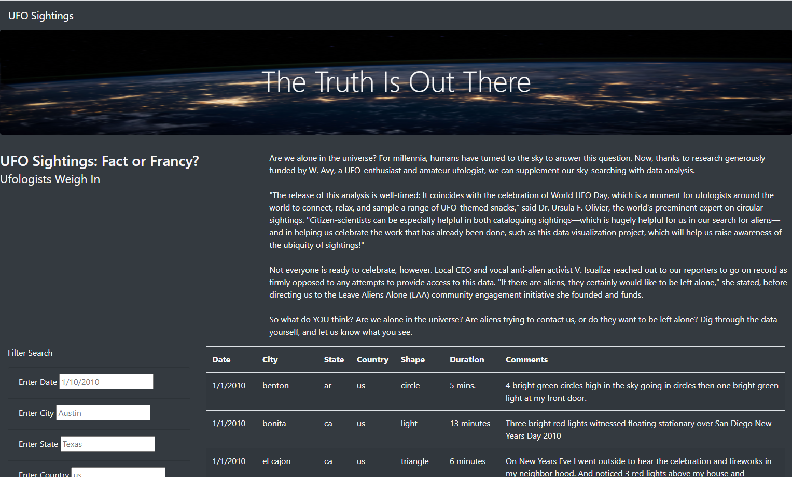
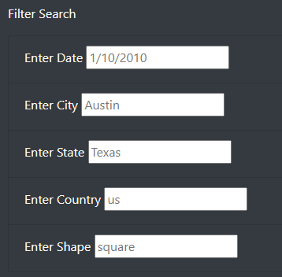

# UFOs

## Overview of Project
Dana is really interested in UFOs and wants to leverage her knowledge of JavaScript to create a website to explore UFO data. She hopes to add this website to her portfolio so one day, she may be able to work for NASA. Using the data she has gathered, we helped her build a dynamic website to better understand UFOs.
## Results

As seen in the picture above, the website we have built is dynamic and allows users to filter the data table. We set it up to allow users to filter on one or multiple criteria by simply typing in one of the boxes. Using these filters, users can quickly understand more about instances of UFOs by location, date, and shape.
## Summary
The biggest drawback of this website is that it does not filter by duration. Duration can be really important in UFO sighting and can effect the validity of a sighting. 
The two biggest reccomendations for further development would be to add a column for the color of each sighting as the colors are almost always described in the comments and to also examine in the data if there were similar sighting at the same time in close places.
